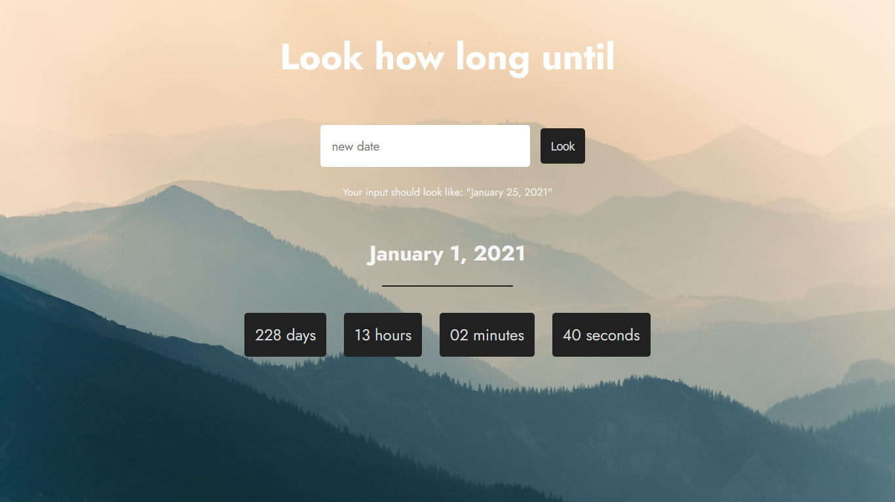

This project was bootstrapped with [Create React App](https://github.com/facebook/create-react-app).

## Project Preview

## Topics Covered in Course
[ReactJS and Redux - Build 4 Web Apps [1/4]](https://www.skillshare.com/classes/ReactJS-and-Redux-Build-4-Web-Apps-14/1262069474)

### React Components 
 > Re-usable and independent pieces of React code that comprise the User Interface.
### ES6 importing and exporting 
 > A new syntax for sharing code between separate files. Used in cases like `import React from ‘react’`
### State 
> The pertinent data to an application. Each component has its local state as long as you declare add the constructor to a Component and declare its state object.
### Updating State 
> When updating state, make sure to never mutate state directly. Doing so will lead to fatal errors in your application. Instead, re-declare new instances of state arrays or objects and use the setState() function to update state.
### Props 
> Similar to state, except this data inherits from parent component specifying pieces of state as properties.
### LifeCycle Methods 
> Events in React components that trigger in cases such as rendering on or off the screen, or during state updates. One example is the `componentDidMount()` lifeCycle hook.

### `npm start`

Runs the app in the development mode. 
Open [http://localhost:3000](http://localhost:3000) to view it in the browser.

The page will reload if you make edits. 
You will also see any lint errors in the console.
